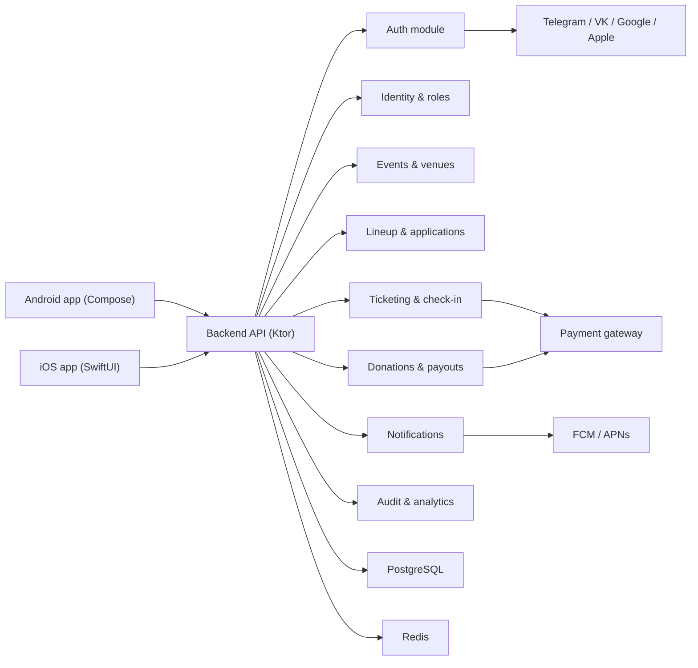

# 05. Архитектура системы

## 5.1. Архитектурный подход

Рекомендуемая архитектура для следующего этапа проекта:
- mobile clients: `Kotlin Multiplatform` для shared domain/data/viewmodel слоя;
- UI раздельно:
  - Android: Jetpack Compose;
  - iOS: SwiftUI;
- backend: `Ktor` как модульный монолит;
- DB: `PostgreSQL`;
- real-time и короткоживущие данные: `Redis`;
- async side effects: transactional outbox + background workers;
- object storage: S3-compatible storage для media/assets при необходимости;
- внешние провайдеры: auth providers, payment gateway, push providers.

## 5.2. Почему модульный монолит, а не сразу набор сервисов

Для MVP и ближайших итераций нужен контроль над целостностью доменных операций:
- hold места;
- заказ;
- ticket issuance;
- status changes;
- donation processing;
- live lineup updates.

Это сильносвязанные сценарии. Преждевременное разбиение на микросервисы повысит стоимость:
- транзакций;
- отладки;
- наблюдаемости;
- синхронизации команд.

Рекомендуемая стратегия:
- сейчас: модульный монолит на backend;
- потом: при росте нагрузки выносить только очевидные bounded contexts.

## 5.3. Верхнеуровневая схема

## 5.4. Клиентская архитектура

### Shared слой

В `commonMain` должны жить:
- domain models;
- use cases;
- repositories interfaces;
- shared ViewModel/MVI logic;
- policy/validation logic;
- serialization/contracts;
- real-time event handling adapters.

### Android слой

В Android остаются:
- Compose UI;
- platform navigation;
- secure storage adapters;
- push token registration;
- payment SDK wrappers;
- camera/QR scanner;
- app lifecycle handling.

### iOS слой

В iOS остаются:
- SwiftUI screens;
- native navigation;
- Keychain adapters;
- APNs token registration;
- camera/QR scanner;
- browser/native auth wrappers;
- payment SDK / web checkout wrappers.

## 5.5. Рекомендуемая модульность репозитория

Текущий проект уже содержит `feature:auth`, `data:auth`, `composeApp`, `iosApp`, `server`. Следующий шаг — выделять предметные домены отдельными модулями.

### Mobile shared

- `core:common`
- `core:network`
- `core:storage`
- `core:payments`
- `core:realtime`
- `feature:auth`
- `feature:onboarding`
- `feature:event-catalog`
- `feature:event-details`
- `feature:organizer-dashboard`
- `feature:venue-builder`
- `feature:lineup`
- `feature:ticketing`
- `feature:checkin`
- `feature:donations`
- `feature:profile`
- `feature:notifications`
- `data:auth`
- `data:events`
- `data:venues`
- `data:lineup`
- `data:tickets`
- `data:donations`
- `data:notifications`

### Backend bounded contexts

- `auth`
- `identity`
- `organizer`
- `venues`
- `events`
- `lineup`
- `ticketing`
- `checkin`
- `donations`
- `notifications`
- `analytics`

## 5.6. Стратегия real-time

Для InComedy real-time нужен не “для красоты”, а для фактического рабочего процесса.

### Real-time сценарии

- текущий комик на сцене;
- next up;
- изменение фактического порядка;
- sold out / released inventory;
- статус check-in;
- live-обновления списка гостей для команды;
- оперативные уведомления по проблемам оплаты/входа.

### Рекомендация

- REST/JSON для CRUD и обычных операций.
- WebSocket для live event channel.
- Push как fallback и для фона.

## 5.7. Стратегия фоновых операций

Критичные процессы нельзя держать только в request-response:
- обработка webhook PSP;
- освобождение истёкших hold;
- рассылка push;
- синхронизация payout статусов;
- повторные попытки отправки событий.

Рекомендация:
- фиксировать доменное событие в Postgres;
- писать его в outbox в той же транзакции;
- worker отправляет событие во внешние системы и в real-time каналы.

## 5.8. Инварианты архитектуры

- UI не знает деталей конкретного payment provider.
- UI не знает деталей конкретного auth provider beyond launch/complete contract.
- Seat inventory изменяется только через ticketing domain.
- Live stage status изменяется только через lineup domain.
- Все финансовые операции должны быть идемпотентны.
- Внешний webhook не может напрямую менять UI state без подтверждённой серверной бизнес-логики.

## 5.9. Безопасность как часть архитектуры

- Secure storage для токенов на mobile.
- Short-lived access token + rotated refresh token.
- Server-side verification всех auth assertions.
- Request id, audit log, structured logs.
- Idempotency keys на checkout/donation.
- Секреты только в runtime config.
- RBAC на organizer/team operations.
- Row-level locking / transactional guarantees для seat hold и оплаты.

## 5.10. Почему публичный чат лучше отложить

Открытый event chat выглядит естественно, но резко повышает объём задач:
- moderation;
- anti-spam;
- reporting;
- content storage;
- abuse support;
- legal/privacy.

Поэтому для MVP рекомендуется:
- announcements/event feed;
- системные уведомления;
- точечные operational threads при необходимости.

Полноценный публичный чат — P1 после базовой стабильности продаж и live-операций.
