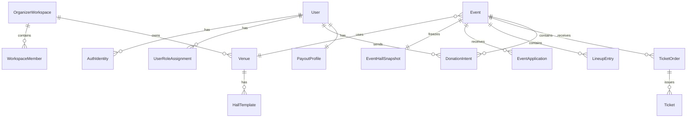

# 06. Доменная модель и данные

## 6.1. Главные bounded contexts

- Identity & Access
- Organizer Workspace
- Venues & Hall Layouts
- Events
- Comedian Applications & Lineup
- Ticketing & Check-in
- Donations & Payouts
- Notifications
- Audit & Analytics

## 6.2. Ключевые сущности

## Identity & Access

### User

- `id`
- `status`
- `display_name`
- `username`
- `avatar_url`
- `city`
- `created_at`
- `updated_at`

### AuthIdentity

- `id`
- `user_id`
- `provider` (`telegram`, `vk`, `google`, `apple`)
- `provider_user_id`
- `linked_at`
- `last_login_at`

### UserRoleAssignment

- `id`
- `user_id`
- `role` (`audience`, `comedian`, `organizer`)
- `scope_type`
- `scope_id`
- `status`

## Organizer Workspace

### OrganizerWorkspace

- `id`
- `owner_user_id`
- `name`
- `slug`
- `status`

### WorkspaceMember

- `id`
- `workspace_id`
- `user_id`
- `permission_role`
- `invited_by`
- `joined_at`

## Venues & Hall Layouts

### Venue

- `id`
- `workspace_id`
- `name`
- `address`
- `city`
- `timezone`
- `capacity`
- `contacts_json`

### HallTemplate

- `id`
- `venue_id`
- `name`
- `version`
- `status`
- `layout_json`

`layout_json` должен быть каноническим описанием двумерной схемы:
- stage;
- zones;
- blocks;
- rows;
- seats;
- tables;
- service areas.

### EventHallSnapshot

Снимок схемы зала на момент публикации/начала продаж для конкретного события. Нужен, чтобы будущие правки template не ломали старые билеты.

- `id`
- `event_id`
- `source_template_id`
- `snapshot_json`

## Events

### Event

- `id`
- `workspace_id`
- `venue_id`
- `hall_snapshot_id`
- `title`
- `description`
- `starts_at`
- `doors_open_at`
- `ends_at`
- `status`
- `sales_status`
- `currency`
- `visibility`

### EventStaffAssignment

- `id`
- `event_id`
- `user_id`
- `responsibility_type`
- `granted_by`

## Applications & Lineup

### ComedianProfile

- `user_id`
- `bio`
- `tags`
- `default_set_duration_minutes`
- `media_links_json`
- `payout_status`

### EventApplication

- `id`
- `event_id`
- `comedian_user_id`
- `status`
- `pitch_text`
- `desired_set_minutes`
- `created_at`
- `updated_at`

### LineupEntry

- `id`
- `event_id`
- `comedian_user_id`
- `application_id`
- `order_index`
- `planned_start_at`
- `actual_status`
- `notes`

## Ticketing & Check-in

### PriceZone

- `id`
- `event_id`
- `name`
- `price_minor`
- `currency`
- `sales_start_at`
- `sales_end_at`

### InventoryUnit

Абстракция продаваемой единицы:
- seat;
- table;
- standing zone;
- package/tariff.

Поля:
- `id`
- `event_id`
- `inventory_type`
- `seat_ref`
- `price_zone_id`
- `status`

### SeatHold

- `id`
- `event_id`
- `inventory_unit_id`
- `user_id`
- `expires_at`
- `status`

### TicketOrder

- `id`
- `event_id`
- `buyer_user_id`
- `status`
- `total_minor`
- `currency`
- `idempotency_key`
- `payment_id`
- `created_at`

### Ticket

- `id`
- `order_id`
- `event_id`
- `inventory_unit_id`
- `ticket_type`
- `status`
- `qr_payload`
- `checked_in_at`
- `checked_in_by`

## Donations & Payouts

### DonationIntent

- `id`
- `event_id`
- `comedian_user_id`
- `donor_user_id`
- `amount_minor`
- `currency`
- `message`
- `status`
- `payment_id`
- `idempotency_key`

### PayoutProfile

- `id`
- `user_id`
- `payout_provider`
- `legal_type`
- `verification_status`
- `beneficiary_ref`

### DonationPayout

- `id`
- `donation_id`
- `comedian_user_id`
- `status`
- `gross_minor`
- `fee_minor`
- `net_minor`

## Notifications & Audit

### Notification

- `id`
- `user_id`
- `type`
- `payload_json`
- `channel`
- `status`

### AuditLogEntry

- `id`
- `actor_user_id`
- `scope_type`
- `scope_id`
- `action`
- `payload_json`
- `created_at`

## 6.3. Ключевые связи

## 6.4. Инварианты предметной области

- Один `InventoryUnit` не может одновременно быть `sold` и `available`.
- Активный hold на место может быть только один.
- `Ticket` создаётся только из успешно подтверждённого `TicketOrder`.
- `DonationIntent` возможен только при `verified` payout profile комика.
- `LineupEntry` создаётся только из `approved` заявки или прямого добавления организатором с audit trail.
- Checker не может видеть и менять payout/финансовые сущности.
- Изменение схемы зала после старта продаж не должно ломать уже созданные билеты.

## 6.5. Машины состояний

### Order lifecycle

`draft -> awaiting_payment -> paid -> issued -> checked_in | refunded | canceled | expired`

### Donation lifecycle

`created -> awaiting_payment -> paid -> payout_pending -> paid_out | failed | reversed`

### Event lifecycle

`draft -> published -> sales_open -> sales_paused -> sold_out -> in_progress -> completed -> archived`

Дополнительная ветка:

`draft|published|sales_open -> canceled`

## 6.6. Что особенно важно для БД

- Индексы по:
  - `event_id`
  - `user_id`
  - `status`
  - `starts_at`
  - `workspace_id`
- Уникальность:
  - `(provider, provider_user_id)` для `AuthIdentity`
  - `(event_id, inventory_unit_id)` для активных билетов/hold
  - `(event_id, comedian_user_id)` для активной заявки при выбранной политике
- Блокировки:
  - на уровне строки/инвентаря во время hold/checkout
- Мягкое удаление:
  - для событий и связанной операционной истории вместо физического удаления

## 6.7. Что сознательно не нужно усложнять в MVP

- Не нужен полноценный CAD-редактор схемы зала.
- Не нужно моделировать многозальную площадку со сложной вложенностью.
- Не нужно сразу проектировать сложный revenue share между десятью получателями.
- Не нужно строить универсальную CMS.
